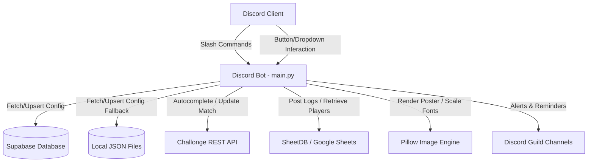

# ⚓ TASK FORCE TRIDENT — Discord Tournament Bot

A premium, fully-featured Discord tournament management bot built for the **TASK FORCE TRIDENT** esports organisation. 
Officiates events, synchronises schedules with Challonge brackets, records scores, tracks staff activity, and generates customized match event posters.

---

## 📑 Table of Contents

1. [Bot Overview](#-bot-overview)
2. [System Architecture](#%EF%B8%8F-system-architecture)
   - [Data Flow Diagram](#data-flow-diagram)
   - [Core Components](#core-components)
3. [Database Configuration (Supabase)](#-database-configuration-supabase)
4. [Command Reference](#-command-reference)
   - [System Commands](#-system-commands)
   - [Player Commands](#-player-commands)
   - [Event Management Commands](#-event-management-commands)
   - [Judge Commands](#-judge-commands)
   - [Admin Commands](#-admin-commands)
5. [Player Information System](#-player-information-system)
6. [Event Lifecycle](#-event-lifecycle)
7. [Environment Setup & Installation](#-environment-setup--installation)

---

## 🤖 Bot Overview

| Property | Details |
|---|---|
| Framework | `discord.py` (v2.x) with Slash Commands (`app_commands`) |
| Language | Python 3.10+ |
| Primary Database | **Supabase** (PostgreSQL) |
| Local Fallback | JSON flat-files (`guild_configs.json`, `tournaments.json`, `scheduled_events.json`) |
| APIs Integrated | Challonge API, SheetDB API (Google Sheets) |
| Image Engine | `Pillow (PIL)` with custom Font scaling & overlay engine |
| Accent Color | Navy Blue (`#1E3A5F`) |

---

## 🛠️ System Architecture

The bot is designed to be fully multi-server (multi-tenant), storing independent configurations, tournaments, and events for each Discord guild.

### Data Flow Diagram



### Core Components

1. **Discord Command Listener (`main.py`):** Coordinates interactions, slash commands, views, and button clicks. Resolves context safety using task-local `ContextVar` parameters (`current_guild_id`) to load the correct server config.
2. **Supabase Client (`supabase-py`):** Acts as the primary backend database. Handles configurations (`GuildConfig` table) and tournament setups (`Tournaments` table).
3. **Local Persistence Engine:** Flat JSON files automatically cache database records locally, guaranteeing the bot boots even if Supabase is offline.
4. **SheetDB Integration:** Pushes tournament logs, results, staff stats, and assignments to Google Sheets in the background via asynchronous threads (`asyncio.to_thread`) to avoid blocking Discord interactions.
5. **Challonge Integration:** Officiates bracket scores directly. Fetches open matches dynamically for command autocompletion and pushes match outcomes to the bracket.
6. **Poster Generator (`Pillow`):** Loads randomly selected background templates, resolves customized fonts (DS-Digital, Square One, Capture It), scales text sizes dynamically to fit names without clipping, and renders the match details.

---

## 🗄️ Database Configuration (Supabase)

The bot operates on five main tables in Supabase:

1. **`GuildConfig`:** Stores server configurations (rules channel, schedule channel, judge role, results channel, organization name).
2. **`Tournaments`:** Holds configurations for individual tournaments created in the guild.
3. **`Events`:** Records created matches. (Columns: `Created_By_ID` and `Created_By_Name` must be present).
4. **`JudgeAssignments`:** Logs judge and recorder claims and assignments.
5. **`Results`:** Saves finalized match scores, remarks, and screenshot attachment counts.
6. **`StaffStats`:** Increments match points for judges/recorders on the leaderboards.
7. **`Challonge_Uploads`:** Records Challonge score update success/failure histories.

---

## 📋 Command Reference

### ⚙️ System Commands
- `/help` — Displays interactive paginated guide with category filters.
- `/info` — Displays bot status, ping, and server information.
- `/staff-leaderboard` — Shows current leaderboards for Judges & Recorders.

### 🎮 Player Commands
- `/player_information` — Searches your configured Google Sheet for a player/captain and outputs their roster, IGNs, and Discord ID mentions.
- `/id-card` — Generates a customized graphic Clan ID Card for a player.
- `/maps` — Randomly rolls a map selection (3, 5, or 7 maps) from the map pool.
- `/choose` — Picks an item from a comma-separated list.
- `/time` — Generates a random match time slot within specific parameters.

### 🏆 Event Management Commands
- `/event-create` — Creates a match event, generates a poster with scaling font margins, logs the event to the database, and schedules pre-match reminders.
- `/event-edit` — Edits details of the active match (reschedule time, captains, round) in the current channel.
- `/event-delete` — Un-schedules and deletes a scheduled match.
- `/exchange` — Swaps a Judge or Recorder for an event.

### ⚖️ Judge Commands
- **Take Schedule** button — Claims the match in the `#schedule` channel.
- **Record** button — Claims the recorder slot for the match.
- `/reassign` — Resigns from an assigned match and notifies other judges.
- `/available_events` — Lists scheduled matches needing a judge.
- `/event-result` — Enters official match results, uploads screenshots, logs stats, and posts results.
- `/upload-score` — Uploads scores directly to Challonge bracket using an autocomplete match list. Takes exactly three parameters:
  - `winner` (Dropdown selection): Autocompleted list of active matches in the format `Team A VS Team B (Winner: Team A)`.
  - `winner_score` (Integer): Final score of the winner.
  - `loser_score` (Integer): Final score of the loser.

### 👑 Admin Commands
- `/settings set` — Configures the bot channels and role IDs.
- `/settings edit` — Updates organization branding, sheets, and SheetDB api links.
- `/settings show` — Shows active server credentials.
- `/settings clean` — Resets server configurations to defaults.
- `/tournament add` — Configures a tournament.
- `/tournament edit` — Edits tournament settings or sets states (`pending`, `active`, `completed`).
- `/tournament list` — Shows all tournaments configured for this guild.

---

## 🎮 Player Information System

The `/player_information` command searches your Google Sheet. Setup requires columns matching your format:
- **1 vs 1 Columns:** `Player Discord ID` | `Player Game Name` | `Player Game ID` | `Player Title`
- **Team Columns (2v2 - 5v5):** `Team Name` | `Captain Discord ID` | `Captain Game Name` | `Captain Game ID` | `Captain Title` | `Player 2 Discord ID` ... `Player 5 Title`

To configure:
```
/config_player_info link:<google_sheet_url> format:<1 vs 1 | 2 vs 2 | ... | 5 vs 5>
```

---

## 🔄 Event Lifecycle

1. **Create:** `/event-create` creates match → Renders poster banner → Logs to database → Posts schedule.
2. **Claim:** Judges/Recorders click buttons in the `#schedule` channel to assign themselves.
3. **Pings:** Pre-match pings trigger 20 minutes and 10 minutes before the start time.
4. **Officiate:** Match starts → claim buttons disable automatically.
5. **Finalize:** Judge runs `/event-result` to log scores and post to the `#results` channel.
6. **Sync:** Results upload to Challonge automatically via `/upload-score` dropdown.

---

## 🔧 Environment Setup & Installation

### Local Setup
1. Clone the repository.
2. Install requirements:
   ```bash
   pip install -r requirements.txt
   ```
3. Create a `.env` file containing:
   ```env
   DISCORD_TOKEN=your_token
   SUPABASE_URL=your_supabase_url
   SUPABASE_KEY=your_supabase_service_role_key
   ```
4. Run the bot:
   ```bash
   python main.py
   ```

*Built for **TASK FORCE TRIDENT** · Powered by discord.py and Supabase*
