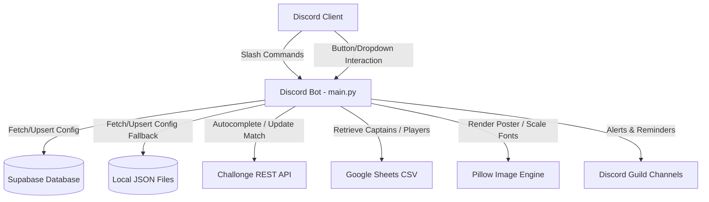

# 🏆 Tournament Bot

<div align="center">


**A fully-featured, multi-guild Discord tournament management bot.**  
Officiates events · Syncs Challonge brackets · Tracks staff · Generates match posters

</div>

---

## 📑 Table of Contents

1. [Bot Overview](#-bot-overview)
2. [System Architecture](#️-system-architecture)
   - [Data Flow Diagram](#data-flow-diagram)
   - [Core Components](#core-components)
3. [Database Configuration (Supabase)](#️-database-configuration-supabase)
4. [Command Reference](#-command-reference)
   - [System Commands](#️-system-commands)
   - [Player Commands](#-player-commands)
   - [Event Management Commands](#-event-management-commands)
   - [Judge Commands](#️-judge-commands)
   - [Admin Commands](#-admin-commands)
5. [Player Information System](#-player-information-system)
6. [Event Lifecycle](#-event-lifecycle)
7. [Environment Setup & Installation](#-environment-setup--installation)
8. [Credits](#-credits--developer-info)
9. [Changelog](#️-version-history--changelog)

---

## 🤖 Bot Overview

| Property | Details |
|---|---|
| Framework | `discord.py` (v2.x) with Slash Commands (`app_commands`) |
| Language | Python 3.11+ |
| Primary Database | **Supabase** (PostgreSQL) |
| Local Fallback | JSON flat-files (`guild_configs.json`, `tournaments.json`, `scheduled_events.json`) |
| APIs Integrated | Challonge API, Google Sheets (CSV lookup) |
| Image Engine | `Pillow (PIL)` with custom font scaling & overlay engine |
| Deployment | [bot.hosting.net](https://bot.hosting.net) (Python VPS hosting) |
| Multi-Server | ✅ Fully multi-guild / multi-tenant |

---

## 🛠️ System Architecture

The bot is designed to be fully multi-server (multi-tenant), storing independent configurations, tournaments, and events for each Discord guild.

### Data Flow Diagram



### Core Components

1. **Discord Command Listener (`main.py`):** Coordinates interactions, slash commands, views, and button clicks. Resolves context safety using task-local `ContextVar` parameters (`current_guild_id`) to load the correct server config.
2. **Supabase Client (`supabase-py`):** Acts as the primary backend database. Handles configurations (`GuildConfig` table) and tournament setups (`Tournaments` table).
3. **Local Persistence Engine:** Flat JSON files automatically cache database records locally, guaranteeing the bot boots even if Supabase is offline.
4. **Google Sheets Roster Integration:** Fetches captain mappings and player/team registration details dynamically from Google Sheets using unauthenticated CSV exports, keeping Discord commands fast and responsive.
5. **Challonge Integration:** Officiates bracket scores directly. Fetches open matches dynamically for command autocompletion and pushes match outcomes to the bracket.
6. **Poster Generator (`Pillow`):** Loads randomly selected background templates, resolves customized fonts (DS-Digital, Square One, Capture It), scales text sizes dynamically to fit names without clipping, and renders the match details.

---

## 🗄️ Database Configuration (Supabase)

The bot operates on the following tables in Supabase:

| Table | Purpose |
|---|---|
| `GuildConfig` | Server configurations (rules channel, schedule channel, judge role, results channel, organization name) |
| `Tournaments` | Configurations for individual tournaments per guild |
| `Events` | Created match records (`Created_By_ID`, `Created_By_Name` columns required) |
| `JudgeAssignments` | Logs judge and recorder claims and assignments |
| `Results` | Finalized match scores, remarks, and screenshot attachment counts |
| `StaffStats` | Match points for judges/recorders on the leaderboards |
| `Challonge_Uploads` | Challonge score update success/failure histories |

---

## 📋 Command Reference

### ⚙️ System Commands
- `/help` — Displays a link to the comprehensive Notion Help Guide.
- `/info` — Displays bot status, ping, and server information.
- `/staff-leaderboard` — Shows current leaderboards for Judges & Recorders.

### 🎮 Player Commands
- `/player_information` — Searches the configured Google Sheet for a player/captain and outputs their roster, IGNs, and Discord ID mentions.
- `/id-card` — Generates a customized graphic Clan ID Card for a player.
- `/maps` — Randomly rolls a map selection (3, 5, or 7 maps) from the map pool.
- `/choose` — Picks an item from a comma-separated list.
- `/time` — Generates a random match time slot within specific parameters.

### 🏆 Event Management Commands
- `/event-create` — Creates a match event, generates a poster with scaling font margins, logs the event to the database, and schedules pre-match reminders.
- `/event-edit` — Edits details of the active match (reschedule time, captains, round) in the current channel.
- `/event-delete` — Un-schedules and deletes a scheduled match.
- `/exchange` — Swaps a Judge or Recorder for an event.

### ⚖️ Judge Commands
- **Take Schedule** button — Claims the match in the `#schedule` channel.
- **Record** button — Claims the recorder slot for the match.
- `/reassign` — Resigns from an assigned match and notifies other judges.
- `/available_events` — Lists scheduled matches needing a judge.
- `/event-result` — Enters official match results, uploads screenshots, logs stats, and posts results.
- `/add-record-link` — Adds a VOD or recording link to a match (for Recorders, Judges, and Helpers).
- `/upload-score` — Uploads scores directly to Challonge bracket using an autocomplete match list. Takes exactly three parameters:
  - `winner` (Dropdown): Autocompleted list of active matches. Inside a match ticket, shows clean team/player names by matching the channel topic `MatchID:XXXX`. Otherwise formats as `TeamName (vs OpponentName)`.
  - `winner_score` (Integer): Final score of the winner.
  - `loser_score` (Integer): Final score of the loser.

### 👑 Admin Commands
- `/settings add` — Set server-wide role mappings and branding parameters (organization name, sheet links, bot name).
- `/settings edit` — Modify server-wide role mappings and branding parameters.
- `/settings show` — Displays a clean embed detailing all active server roles and configurations.
- `/settings clean` — Resets all configuration data, deletes guild database tables, and wipes local cache files.
- `/tournament add` — Registers a tournament configuration (name, Challonge key, bracket link, sheet link, channels, categories, auto room setting).
- `/tournament edit` — Modifies an existing tournament config (bracket link, sheet link, channels, open/closed ticket categories, state: `pending`, `active`, `completed`).
- `/tournament delete` — Deletes tournament from database and local cache.
- `/tournament info` — Displays detailed channels, roles, and status of a tournament.
- `/tournament list` — Lists all tournaments registered for the server.
- `/auto_room run` — Manually triggers the automatic match room ticket creation sweep.
- `/auto_room stop` — Suspends the automatic match room loop for a tournament.
- `/auto_room toggle` — Toggles the automatic match room loop status.
- `/clear category` — Deletes all open/closed ticket channels in a specified category (Organizer only).
- `/clear cache` — Clears Challonge bracket and sheet caches.
- `/registration` — Publishes a Google Form registration embed with a direct button.
- `/publish-rules` — Writes and publishes tournament rules directly to guidelines.
- `/test_channels` — Runs a diagnostic check on bot permissions in configured channels.
- `/staff-update` — Manually update staff stats/points on the leaderboard.

---

## 🎮 Player Information System

The `/player_information` command searches your Google Sheet. Setup requires columns matching your format:

- **1 vs 1 Columns:** `Player Discord ID` | `Player Game Name` | `Player Game ID` | `Player Title`  
  *(Supports flexible match names like `Discord`, `UID`, `ID`, `IGN`)*
- **Team Columns (2v2 – 5v5):** `Team Name` | `Captain Discord ID` | `Captain Game Name` | `Captain Game ID` | `Captain Title` | `Player 2 Discord ID` ... `Player 5 Title`

Configure links and formats via `/settings add` or `/settings edit` using the `player_info_link` and `player_info_format` parameters.

---

## 🔄 Event Lifecycle

```
/event-create → Poster Generated → Logged to DB → Schedule Posted
     ↓
Judge/Recorder claim via buttons in #schedule
     ↓
[T-30 min] Presence Ask → Confirmation embed sent to ticket
     ↓
[T-20 min] Presence Check → Unconfirmed staff replaced
     ↓
[T-10 min] Captains Reminder sent to ticket
     ↓
/event-result → Scores logged → Screenshots uploaded → Results posted
     ↓
/upload-score → Challonge bracket updated
```

| Step | Trigger | Action |
|---|---|---|
| **Create** | `/event-create` | Renders poster, logs to DB, posts schedule |
| **Claim** | Button click | Judge/Recorder assigned; ticket notified |
| **Presence Ask** | T-30 min | Confirmation embed sent to match ticket |
| **Presence Check** | T-20 min | Confirms staff; triggers replacement if absent |
| **Player Reminder** | T-10 min | Match player reminder sent to captains |
| **Finalize** | `/event-result` | Logs scores, screenshots, posts results embed |
| **Sync** | `/upload-score` | Pushes result to Challonge bracket |

---

## 🔧 Environment Setup & Installation

### Prerequisites

- Python **3.11+**
- A [Discord Bot Token](https://discord.com/developers/applications)
- A [Supabase](https://supabase.com) project with the required schema
- A [Challonge](https://challonge.com/settings/developer) API key (optional)

### Local Setup

1. **Clone the repository:**
   ```bash
   git clone https://github.com/your-username/tournament-bot.git
   cd tournament-bot
   ```

2. **Install dependencies:**
   ```bash
   pip install -r requirements.txt
   ```

3. **Configure environment variables** — copy and fill in `.env`:
   ```bash
   cp env.example .env
   ```
   ```env
   DISCORD_TOKEN=your_discord_bot_token
   SUPABASE_URL=your_supabase_project_url
   SUPABASE_KEY=your_supabase_service_role_key
   ```

4. **Run the bot:**
   ```bash
   python main.py
   ```

### bot.hosting.net Deployment

The bot is hosted on [bot.hosting.net](https://bot.hosting.net), a Python-friendly VPS platform built for Discord bots.

1. Log in to your [bot.hosting.net](https://bot.hosting.net) panel and create a new **Python** server.
2. Upload your project files (or connect via Git/SFTP).
3. Set the **Startup File** to `main.py`.
4. Add the three environment variables under the **Startup** or **Environment** tab:
   - `DISCORD_TOKEN`
   - `SUPABASE_URL`
   - `SUPABASE_KEY`
5. Install dependencies in the panel's console:
   ```bash
   pip install -r requirements.txt
   ```
6. Click **Start** — the bot will go online.

### Database Setup

Import `supabase_schema.sql` into your Supabase SQL editor to create all required tables.

---

## 👥 Credits & Developer Info

| Role | Name |
|---|---|
| Developer | **Siva Subramaniam** |
| Discord | `Hokage` |

---

## 🗓️ Version History & Changelog

> **Latest Release:** `v1.4.0`

### 🚀 v1.4.0 — Latest
**Tags:** `feature` `help-system` `commands`

> **GitHub Release Title:** `v1.4.0 - Help Guide & Record Link`
>
> This release simplifies the in-bot help experience and adds VOD tracking for match recorders.

#### What's Changed
- **New Help Guide System:** Replaced the complex 500-line static paginated command dictionary with a link to a central Notion Help Guide — keeping the bot code lean and the guide easy to update without redeployments.
- **Add Record Link Command:** Introduced `/add-record-link`, allowing Judges, Recorders, and Helpers to associate VOD/recording links with scheduled matches.

#### Full Changelog
`v1.3.1...v1.4.0`

---

### 🔧 v1.3.1
**Tags:** `bugfix` `poster-engine` `path-resolution`

> **GitHub Release Title:** `v1.3.1 - Poster Path & Result Embed Fix`
>
> Hotfix addressing poster generation failures and missing posters in result embeds.

#### What's Changed
- **Absolute Path Resolution:** Resolved image templates and local fonts relative to the script directory (`BASE_DIR`) dynamically, fixing errors where posters weren't generating when the bot was run from a different working directory.
- **Match Poster in Result Embed:** Integrated match posters into results cards generated by `/event-result` by fetching the previously rendered poster path from the scheduled event data and attaching it to the final result embed.

#### Full Changelog
`v1.3.0...v1.3.1`

---

### ✨ v1.3.0
**Tags:** `feature` `staff-flow` `autocomplete` `ui`

> **GitHub Release Title:** `v1.3.0 - Staff Flow Overhaul & Sleeker UI`
>
> Major UX improvement release — tightens the staff presence pipeline, cleans up autocomplete, and makes result embeds much more compact.

#### What's Changed
- **Staff Timings Shift:** Realigned pre-match staff confirmation to a 30-minute presence check-in, 20-minute presence validation/replacement trigger, and 10-minute player match reminder flow.
- **Simplified Claim Messages:** Replaced initial claim embeds in tickets with plain-text `{mention} assigned as **role** {emoji}` alerts. Confirmation buttons are now exclusively posted at the 30-minute reminder mark.
- **Sleeker Autocomplete:** Restructured `/upload-score` autocompletes to show clean team/player names. If executed inside a match ticket, it automatically reads the channel topic's `MatchID:XXXX` and shows only the relevant two competing teams.
- **Tighter Results Layout:** Removed redundant vertical blank space fields from the `/event-result` embed.
- **Detailed Logs:** Log presence confirmations, staff replacements, and score uploads directly to the Discord bot logs and tournament-specific Challonge logs channels.

#### Full Changelog
`v1.2.0...v1.3.0`

---

### 🗄️ v1.2.0
**Tags:** `database` `branding` `sheets`

> **GitHub Release Title:** `v1.2.0 - Database Alignment & Sheet Tab Support`
>
> Internal database cleanup and Google Sheets improvements for more reliable player lookups.

#### What's Changed
- **Database Alignment:** Re-arranged and cleaned up `GuildConfig` and `Tournaments` database column header orders in Supabase to match custom sheet sequences exactly.
- **Branding Clean:** Removed `Tournament Name`, `Player Info Link`, and `Player Info Format` fields from the `/settings show` embed presentation.
- **Google Sheet Tab `gid` Support:** Updated player information commands to extract the sheet tab ID (`gid=`) from the URL, syncing the exact configured sheet sub-tab instead of defaulting to the first tab.
- **Deployment Crash Fix:** Added the missing `supabase` package dependency to `requirements.txt` to prevent boot crashes on hosted deployment.

#### Full Changelog
`v1.1.0...v1.2.0`

---

### 🏗️ v1.1.0
**Tags:** `supabase` `multi-guild` `challonge`

> **GitHub Release Title:** `v1.1.0 - Supabase Backend & Multi-Guild Support`
>
> Moves the bot off local-only JSON storage onto a cloud PostgreSQL backend, enabling reliable multi-server operation.

#### What's Changed
- **Supabase Integration:** Migrated guild configs and tournament settings storage to Supabase PostgreSQL backend.
- **Multi-Guild Isolation:** Added workspace isolation supporting config/attendance channels across multiple Discord servers.
- **Challonge Logs:** Added tracking database tables for bracket upload stats.

#### Full Changelog
`v1.0.0...v1.1.0`

---

### 🌱 v1.0.0 — Initial Release
**Tags:** `initial-release` `core`

> **GitHub Release Title:** `v1.0.0 - Initial Release`
>
> First stable release of the Tournament Bot. Covers the complete event lifecycle from scheduling to result submission.

#### What's New
- Full event lifecycle management (`/event-create` → claims → reminders → `/event-result`).
- Judge & Recorder claim buttons in the schedule channel.
- PIL-powered match poster generation with custom fonts and background templates.
- Local JSON config caching for offline-safe boot.
- Challonge bracket score upload via `/upload-score`.

#### Full Changelog
`Initial commit...v1.0.0`

---

## 📄 License

This project is licensed under the [MIT License](LICENSE).

---

<div align="center">

Built with ❤️ by **Siva Subramaniam** · Powered by `discord.py` and `Supabase`

</div>
