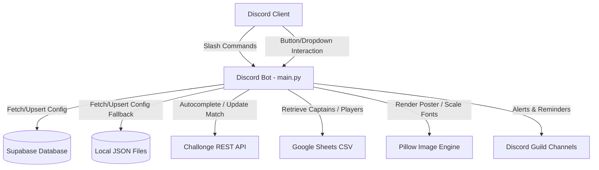

# 🏆 Tournament Bot

<div align="center">


**A fully-featured, multi-guild Discord tournament management bot.**  
Officiates events · Syncs Challonge brackets · Tracks staff · Generates match posters · Generates HTML transcripts

</div>

---

## 📑 Table of Contents

1. [Bot Overview](#-bot-overview)
2. [System Architecture](#️-system-architecture)
   - [Data Flow Diagram](#data-flow-diagram)
   - [Core Components](#core-components)
3. [Database Configuration (Supabase)](#️-database-configuration-supabase)
4. [Command Reference](#-command-reference)
   - [System Commands](#️-system-commands)
   - [Player Commands](#-player-commands)
   - [Event Management Commands](#-event-management-commands)
   - [Link & VOD Management Commands](#-link--vod-management-commands)
   - [Judge & Staff Commands](#️-judge--staff-commands)
   - [Admin Commands](#-admin-commands)
5. [Player Information System](#-player-information-system)
6. [Ticket & Transcript System](#-ticket--transcript-system)
7. [Event Lifecycle](#-event-lifecycle)
8. [Environment Setup & Installation](#-environment-setup--installation)
9. [Credits](#-credits--developer-info)
10. [Changelog](#️-version-history--changelog)


---

## 🤖 Bot Overview

| Property | Details |
|---|---|
| Framework | `discord.py` (v2.x) with Slash Commands (`app_commands`) |
| Language | Python 3.11+ |
| Primary Database | **Supabase** (PostgreSQL) |
| Local Fallback | JSON flat-files (`guild_configs.json`, `tournaments.json`, `scheduled_events.json`) |
| APIs Integrated | Challonge API, Google Sheets (CSV lookup) |
| Image Engine | `Pillow (PIL)` with custom font scaling & overlay engine |
| Deployment | [bot.hosting.net](https://bot.hosting.net) (Python VPS hosting) |
| Multi-Server | ✅ Fully multi-guild / multi-tenant |

---

## 🛠️ System Architecture

The bot is designed to be fully multi-server (multi-tenant), storing independent configurations, tournaments, and events for each Discord guild.

### Data Flow Diagram



### Core Components

1. **Discord Command Listener (`main.py`):** Coordinates interactions, slash commands, views, and button clicks. Resolves context safety using task-local `ContextVar` parameters (`current_guild_id`) to load the correct server config.
2. **Supabase Client (`supabase-py`):** Acts as the primary backend database. Handles configurations (`GuildConfig` table) and tournament setups (`Tournaments` table).
3. **Local Persistence Engine:** Flat JSON files automatically cache database records locally, guaranteeing the bot boots even if Supabase is offline.
4. **Google Sheets Roster Integration:** Fetches captain mappings and player/team registration details dynamically from Google Sheets using unauthenticated CSV exports, keeping Discord commands fast and responsive.
5. **Challonge Integration:** Officiates bracket scores directly. Fetches open matches dynamically for command autocompletion and pushes match outcomes to the bracket.
6. **Poster Generator (`Pillow`):** Loads randomly selected background templates, resolves customized fonts (DS-Digital, Square One, Capture It), scales text sizes dynamically to fit names without clipping, and renders the match details.

---

## 🗄️ Database Configuration (Supabase)

The bot operates on the following production PostgreSQL tables in Supabase:

| Table | Purpose |
|---|---|
| `GuildConfig` | Server-wide role IDs, default channel IDs, organization branding, logo assets, and player info link/format |
| `Tournaments` | Tournament-specific channel mappings, open/closed ticket categories, Challonge bracket URLs, sheet links, and state (`pending`, `active`, `completed`) |
| `Matches` | Official match records, integer `Round`, `Group`, team IDs/scores, VOD links (`General_VOD`, `Recorder_VOD`, `Judge_VOD`, `recording_link`), results message IDs, and status |
| `MatchStaff` | Assigned match staff, role mappings (`Judge`, `Recorder`), and pre-match presence confirmation statuses |
| `StaffStats` | Official staff activity records (`Judge_Count`, `Recorder_Count`, `Total_Count`, `Timestamp`) synced live |
| `Deadlines` | Scheduled round deadline timestamps per tournament |
| `Players` & `Teams` | Registered player rosters, game IDs, and team profiles |
| `TournamentSponsors` | Sponsor banner placements, logo URLs, and redirect links |
| `SponsorClickLogs` | Real-time analytics tracking sponsor click conversions |
| `AffiliateProducts` | Product catalog, pricing, and affiliate purchase links |

---

## 📋 Command Reference

### ⚙️ System Commands
- `/help` — Displays a link to the comprehensive Notion Help Guide.
- `/info` — Displays bot status, ping, and server information.
- `/staff-leaderboard` — Shows current leaderboards for Judges & Recorders (Solo Judge, Solo Recorder, and Dual Role).
- `/staff work` — View individual staff work breakdown with tournament autocomplete and active filters.

### 🎮 Player Commands
- `/player_information` — Searches the configured Google Sheet for a player/captain and outputs their roster, IGNs, and Discord ID mentions in clean blockquote (`> `) format.
- `/config_player_information` — Configures the player sheet link, format, and participant channel, automatically syncing all participants.
- `/player_edit` — Edits a participant's details in the posted list and database.
- `/id-card` — Generates a customized graphic Clan ID Card for a player.
- `/maps` — Randomly rolls a map selection (3, 5, or 7 maps) from the map pool.
- `/choose` — Picks an item from a comma-separated list.
- `/time` — Generates a random match time slot within specific parameters.

### 🏆 Event Management Commands
- `/event-create` — Creates a match event, generates a poster with scaling font margins and server logo badge, logs the event to Supabase, and schedules pre-match reminders.
- `/event-edit` — Edits details of the active match (reschedule time, captains, round) in the current channel.
- `/event-delete` — Un-schedules and deletes a scheduled match.
- `/exchange` — Swaps a Judge or Recorder for an event.

### 🎥 Link & VOD Management Commands
- `/link add` — Adds recording/VOD links for a match event. Supports up to 5 multi-link inputs (`link1` to `link5`), selects link type (`General Recording`, `Recorder VOD`, `Judge VOD`), awards recorder credit in staff stats, syncs to Supabase `Matches`, and updates the results channel embed live.
- `/link edit` — Edits an existing recording/VOD link for a match.
- `/link delete` — Removes specific link types (`General`, `Recorder`, `Judge`, or `All Links`) from a match record.
- `/link missing` — Displays a paginated view of completed matches missing recording links.

### ⚖️ Judge & Staff Commands
- **Take Schedule** button — Claims the match judge slot in `#schedule`.
- **Record** button — Claims the recorder slot for the match.
- `/reassign` — Resigns from an assigned match and notifies other judges.
- `/available_events` — Lists scheduled matches needing a judge.
- `/event-result` — Enters official match results, uploads screenshots, logs stats, delivers staff attendance logs, and posts results.
- `/upload-score` — Uploads scores directly to Challonge bracket using an autocomplete match list.

### ⏰ Match Deadline Commands
- `/deadline add` — Add and announce a round match deadline in the `#deadlines` channel with `<t:TIMESTAMP:F>` and `<t:TIMESTAMP:R>` relative countdowns. Automatically pings `Players_Role_ID`, saves to Supabase `Deadlines` table, and schedules automated reminder pings (24 hours before & on the day of the deadline at 06:00 UTC).
- `/deadline edit` — Edit an existing deadline's date, time, round, or note. Automatically updates Supabase and posts an update announcement to `#deadlines` pinging players.
- `/deadline delete` — Delete a scheduled round deadline and cancel background automated reminders.
- `/deadline list` — List all active round deadlines with live countdown timestamps.

### 👑 Admin Commands
- `/settings add` — Set server-wide role mappings and branding parameters (organization name, sheet links, bot name).
- `/settings edit` — Modify server-wide role mappings and branding parameters.
- `/settings show` — Displays a clean embed detailing all active server roles and configurations.
- `/settings clean` — Resets all configuration data, deletes guild database tables, and wipes local cache files.
- `/tournament add` — Registers a tournament configuration (name, Challonge key, bracket link, sheet link, channels, categories, auto room setting).
- `/tournament edit` — Modifies an existing tournament config (bracket link, sheet link, channels, open/closed ticket categories, state: `pending`, `active`, `completed`).
- `/tournament delete` — Deletes tournament from database and local cache.
- `/tournament info` — Displays detailed channels, roles, and status of a tournament.
- `/tournament list` — Lists all tournaments registered for the server.
- `/auto_room start` — Starts/enables automatic match room ticket creation and launches the background loop.
- `/auto_room stop` — Suspends the automatic match room loop for a tournament.
- `/auto_room run` — Manually triggers the automatic match room ticket creation sweep.
- `/auto_room toggle` — Toggles the automatic match room loop status.
### 🎫 Automatic Room Creation Commands
- `/auto_room start` — Starts and enables automatic match room ticket creation for a tournament, launching the 5-minute Challonge polling background loop.
- `/auto_room stop` — Suspends automatic room creation and stops the background loop for a tournament.
- `/auto_room toggle` — Toggle automatic match room ticket creation on/off for a tournament (with optional explicit `enabled` boolean). Automatically starts or stops the background 5-minute Challonge polling loop.
- `/auto_room run` — Manually triggers an immediate match room ticket creation sweep for all open Challonge matches, setting up private captain channels and syncing with Supabase.
- `/auto_room status` — Displays detailed auto-room configuration, bracket & sheet links, open categories, and background loop active state.

- `/clear category` — Deletes all open/closed ticket channels in a specified category (Organizer only).
- `/clear cache` — Clears Challonge bracket and sheet caches.
- `/registration` — Publishes a Google Form registration embed with a direct button.
- `/publish-rules` — Writes and publishes tournament rules directly to guidelines.
- `/test_channels` — Runs a diagnostic check on bot permissions in configured channels.
- `/staff-update` — Manually update staff stats/points on the leaderboard.

---

## 🎮 Player Information System

The player information system automatically synchronizes rosters from Google Sheets and renders them using sleek Discord blockquote (`> `) formatting.

### 📱 1 vs 1 Format:
```markdown
<:trophy:1545045388145205298> YG-GamingMW

<:Details:1545045370961133668> @ZeroPing

<:Details:1545045370961133668> **Player details**
> **Discord Tag:** `yg_gamingmw`
> **Discord ID:** `713394981213175829`
> **Verification (Player):** <:Verified:1545045390452334602> Verified
> **Game Name:** `YG-GamingMW`
> **Game ID:** `8202C9AF0056E12A`
> **Title:** `None`
```

### 👥 Team Format (2v2 – 5v5):
```markdown
<:trophy:1545045388145205298> Team Alpha

<:CaptainDetails:1545045368218329208> @CaptainPing

<:CaptainDetails:1545045368218329208> **Captain details**
> **Discord Tag:** `captain_tag`
> **Discord ID:** `111222333444555`
> **Verification (Captain):** <:Verified:1545045390452334602> Verified
> **Game Name:** `CaptainIGN`
> **Game ID:** `CAP12345`
> **Title:** `Leader`

<:Details:1545045370961133668> **Player 2 details**
> **Discord Tag:** `player2_tag`
> **Discord ID:** `666777888999000`
> **Verification (Player):** <:NotVerifed:1545045384274116669> Not verified
> **Game Name:** `Player2IGN`
> **Game ID:** `P2_98765`
> **Title:** `None`
```

- **Supported Columns & Flexible Aliases:**
  - **Discord ID / Tag:** `Player Discord ID`, `Discord Developer ID`, `Discord Tag`, `Discord Username`, `UID`
  - **Game Name:** `In Game Name`, `In-Game Name`, `IGN`, `Game Name`, `Nickname`, `Character Name`, `Player Tag`
  - **Game ID:** `Game ID`, `Game I'd`, `UID`, `Riot ID`, `Player ID`, `In-Game ID`
  - **Title:** `Title`, `Rank`, `Role`, `In-Game Title`
  - **Seed:** `Seed`, `Seed #`, `Seed Number`, `Seeding` (displayed in footer: `Guild • Tournament • Seed #93`)

---

## 📜 Ticket & Transcript System

### Ticket Commands:
- **`$close` / `/close`** — Closes a match ticket channel and executes the permanent transcript pipeline:
  1. Generates a standalone **Discord Dark Theme HTML transcript (`.html`)** with **Base64 inline image embedding** (downloading screenshot bytes directly so images never expire).
  2. Generates a structured **Plain-Text transcript (`.txt`)** with full timestamps and attachment URLs.
  3. Sends both files to the ticket channel.
  4. Automatically uploads transcripts to the tournament's `#transcripts` channel.
  5. Moves the channel to the configured closed tickets category.
- **`$reopen` / `/reopen`** — Reopens a closed ticket channel, clears closed prefixes (`closed-`, `done-`, `🔴-`, `✅-`), and moves the channel back to active match categories with synced permissions.
- **`$delete` / `/delete_room`** — Permanently deletes a ticket channel.
- **Status Prefix Commands**: `?sh` (🟢 scheduled), `?dq` (🔴 disqualified), `?dd` (✅ deadline passed), `?ho` (🟡 on hold).

---

## 🛠️ Moderation & Server Utility Commands

| Command | Subcommands / Parameters | Description |
|---|---|---|
| `/assign_role` | `tournament`, `role`, `id_header?`, `dry_run?` | Assigns a role to all tournament participants from Google Sheets. |
| `/role` | `remove all` | Bulk removes a specified role from all members with confirmation. |
| `/nickname` | `reset` | Resets a member's display name to their username. |
| `/channel` | `lock`, `unlock`, `add` | Locks/unlocks channel for @everyone or adds specific members/roles. |
| `/timeout` | `add`, `remove` | Times out a user (`5m`, `1h`, `1d`, `7d`, `28d`) or removes timeout. |
| `/categorymonitor` | `set`, `view`, `remove` | Monitors channel capacity in categories to prevent the 50-channel limit. |
| `/avatar` | `user?` | Displays user avatar in high resolution with download links. |
| `/server` | `info`, `banlist` | Displays server statistics or exports banned users to CSV/embed. |
| `/clear` | `category`, `cache` | Bulk deletes category channels or flushes cache. |
| `/purge` | `all`, `amount`, `word` | Bulk purges messages from a channel. |


---

## 🔄 Event Lifecycle

```
/event-create → Poster Generated → Logged to Supabase → Schedule Posted
     ↓
Judge/Recorder claim via buttons in #schedule
     ↓
[T-30 min] Presence Ask → Confirmation embed sent to ticket
     ↓
[T-20 min] Presence Check → Unconfirmed staff replaced
     ↓
[T-10 min] Captains Reminder sent to ticket
     ↓
/event-result → Scores logged → Attendance logged → Screenshots uploaded → Results posted
     ↓
/link add → VOD links added (link1..link5) → Results embed updated live → Supabase synced
     ↓
/upload-score → Challonge bracket updated
     ↓
$close → Rich HTML & TXT transcripts generated → Uploaded to #transcript-logs → Channel archived
```

---

## 🔧 Environment Setup & Installation

### Prerequisites

- Python **3.11+**
- A [Discord Bot Token](https://discord.com/developers/applications)
- A [Supabase](https://supabase.com) project with the required schema
- A [Challonge](https://challonge.com/settings/developer) API key (optional)

### Local Setup

1. **Clone the repository:**
   ```bash
   git clone https://github.com/your-username/tournament-bot.git
   cd tournament-bot
   ```

2. **Install dependencies:**
   ```bash
   pip install -r requirements.txt
   ```

3. **Configure environment variables** — copy and fill in `.env`:
   ```bash
   cp env.example .env
   ```
   ```env
   DISCORD_TOKEN=your_discord_bot_token
   SUPABASE_URL=your_supabase_project_url
   SUPABASE_KEY=your_supabase_service_role_key
   ```

4. **Run the bot:**
   ```bash
   python main.py
   ```

### bot.hosting.net Deployment

The bot is hosted on [bot.hosting.net](https://bot.hosting.net), a Python-friendly VPS platform built for Discord bots.

1. Log in to your [bot.hosting.net](https://bot.hosting.net) panel and create a new **Python** server.
2. Upload your project files (or connect via Git/SFTP).
3. Set the **Startup File** to `main.py`.
4. Add the environment variables under the **Startup** or **Environment** tab:
   - `DISCORD_TOKEN`
   - `SUPABASE_URL`
   - `SUPABASE_KEY`
5. Install dependencies in the panel's console:
   ```bash
   pip install -r requirements.txt
   ```
6. Click **Start** — the bot will go online.

---

## 👥 Credits & Developer Info

| Role | Name |
|---|---|
| Developer | **Siva Subramaniam** |
| Discord | `Hokage` |

---

## 🗓️ Version History & Changelog

> **Latest Release:** `v2.0.0`

### 🚀 v2.0.0 — Latest
**Tags:** `emojis` `discord-portal` `branding` `ui-overhaul`

> **GitHub Release Title:** `v2.0.0 - Discord Application Emojis & Custom Brand Assets`
>
> Milestone major release introducing full integration with Discord Developer Portal Application Emojis, dynamic API resolution, and a native UI overhaul replacing raw Unicode characters with custom tournament assets.

#### What's Changed
- **Discord Developer Portal Application Emojis:** Native support for application emojis uploaded directly to the Discord Developer Portal (`Vs`, `Verified`, `NotVerifed`, `NotInServer`, `MatchDone`, `Loser`, `Judge`, `Recorder`, `Details`, `CaptainDetails`, `trophy`).
- **Dynamic Startup Emoji Loader (`bot.fetch_application_emojis`):** Upgraded `core/emojis.py` with an asynchronous `init_emojis_from_bot()` routine in `on_ready` that dynamically fetches and caches application emojis across all servers the bot operates in.
- **Player & Captain UI Transformation:** Replaced legacy placeholder Unicode emojis (`💂`) with customized `CaptainDetails` and `Details` soldier emblems across Google Sheets player info syncs, 1v1 match announcements, and team roster cards.
- **Bespoke Match Announcements & Results:** Integrated `<:Vs:...>` and `<:Loser:...>` badges into `/event-result`, match ticket generation, and result channel embeds.
- **Enhanced `/player_edit` Parser:** Upgraded regex replacement patterns to dynamically recognize and replace both legacy Unicode and custom Discord emoji tokens.

#### Full Changelog
`v1.8.0...v2.0.0`

---

### ⚡ v1.8.0
**Tags:** `architecture` `cogs` `refactoring` `utilities`

> **GitHub Release Title:** `v1.8.0 - Modular Cog Architecture & Server Utilities Suite`
>
> Major architectural overhaul decomposing the monolithic codebase into high-cohesion, modular Discord cogs and adding advanced utility tooling.

#### What's Changed
- **Modular Cog Decomposition:** Migrated from a single monolithic file into a modular `cogs/` package:
  - `cogs.tournaments` — Bracket management, auto room sweep, and match room tickets.
  - `cogs.events` — Event creation, poster rendering, and result logging.
  - `cogs.staff` — Judge/recorder scheduling, presence checks, and work statistics.
  - `cogs.settings` — Server configurations, role mappings, and Google Sheet rosters.
  - `cogs.utilities` — Embed builder, moderation tools, time/map pickers, and category monitors.
  - `cogs.listeners` — Core event lifecycle listeners, persistence handlers, and startup routines.
- **Interactive Embed Builder:** Added persistent multi-button interactive modal embed designer (`/embed`) with color presets, field additions, and live channel delivery.
- **Category Monitor System (`/categorymonitor`):** Real-time monitoring of category channel counts to safeguard against Discord's 50-channel hard limit.
- **Server Moderation Suite:** Added administrative commands including `/channel lock/unlock`, `/timeout add/remove`, `/purge`, and role cleanup tools.

#### Full Changelog
`v1.7.0...v1.8.0`

---

### 🎫 v1.7.0
**Tags:** `automation` `auto-room` `challonge` `tickets`

> **GitHub Release Title:** `v1.7.0 - Automated Room Creation & Challonge Bracket Polling`
>
> Autonomous background engine for automatic match room ticket creation and bracket synchronization.

#### What's Changed
- **Automated Match Room Creation Engine:** Background 5-minute Challonge polling worker that detects open tournament matches and automatically spawns private match ticket channels for competing team captains.
- **Auto-Room Command Suite (`/auto_room`):** Added `/auto_room start`, `/auto_room stop`, `/auto_room toggle`, `/auto_room run`, and `/auto_room status` to give organizers complete control over automated matchmaking.
- **Category Capacity Handling:** Automatically balances match room creation across configured category pools (`Category 1`, `Category 2`) with closed ticket category routing.
- **Match Prefix Commands:** Quick prefix shortcuts for room management: `?sh` (🟢 scheduled), `?dq` (🔴 disqualified), `?dd` (✅ deadline passed), `?ho` (🟡 on hold).

#### Full Changelog
`v1.6.0...v1.7.0`

---

### ⏰ v1.6.0
**Tags:** `deadlines` `reminders` `scheduler` `supabase`

> **GitHub Release Title:** `v1.6.0 - Match Deadlines & Automated Reminders System`
>
> Comprehensive round deadline scheduling with automated Discord reminder pings and Supabase persistence.

#### What's Changed
- **Round Deadline Suite (`/deadline`):** Added `/deadline add`, `/deadline edit`, `/deadline delete`, and `/deadline list` commands for round deadlines.
- **Discord Dynamic Timestamps:** Implemented `<t:TIMESTAMP:F>` (absolute formatted date) and `<t:TIMESTAMP:R>` (live relative countdowns) in deadline announcements.
- **Automated Background Reminders:** Async scheduler that triggers player role reminder pings 24 hours prior to deadline and at 06:00 UTC on the deadline day.
- **Supabase Deadlines Persistence:** Synchronized deadlines to the PostgreSQL `Deadlines` table with fallback local caching in `scheduled_deadlines.json`.

#### Full Changelog
`v1.5.0...v1.6.0`

---

### 🚀 v1.5.0
**Tags:** `transcripts` `vods` `supabase` `ui` `player-info`

> **GitHub Release Title:** `v1.5.0 - Rich Transcripts, Multi-Link VODs & Blockquote Player Info`
>
> Major feature release introducing rich HTML chat transcripts, multi-link VOD uploads, blockquote player info styling, and database hardening.

#### What's Changed
- **Rich HTML Transcripts:** `$close` now generates a standalone Discord Dark Theme `.html` transcript featuring full inline screenshot/image previews, avatar rendering, embed boxes, and markdown parsing, alongside a `.txt` fallback.
- **Transcript Logs Channel Delivery:** Transcripts are automatically posted to the tournament's `#transcript` / `#transcript-logs` channel with a closed ticket metadata embed.
- **Multi-Link VOD System (`/link add`):** Accepts up to 5 recording links (`link1`..`link5`) per match, assigns recorder credit in staff statistics, syncs to the Supabase `Matches` table, and updates result embeds live with numbered part links.
- **Blockquote (`> `) Player Info UI:** Reworked `/player_information` and `/config_player_information` embeds with Discord blockquotes and expanded column aliases (`In-Game Name`, `IGN`, `UID`, `Seed`).
- **Supabase Realignment & Sync:** Fixed PostgreSQL `Matches.Round` integer constraints, eliminated obsolete table fallbacks, and added automatic live syncing of staff leaderboard stats to `StaffStats`.
- **Match Poster Server Badge:** Embedded circular server logo badges with gold ring borders on generated match posters.

#### Full Changelog
`v1.4.0...v1.5.0`

---

### 🚀 v1.4.0
**Tags:** `feature` `help-system` `commands`

> **GitHub Release Title:** `v1.4.0 - Help Guide & Record Link`

#### What's Changed
- **New Help Guide System:** Central Notion Help Guide integration.
- **Add Record Link Command:** Introduced `/add-record-link`.

#### Full Changelog
`v1.3.1...v1.4.0`

---

### 🔧 v1.3.1
**Tags:** `bugfix` `poster-engine` `path-resolution`

> **GitHub Release Title:** `v1.3.1 - Poster Path & Result Embed Fix`

#### What's Changed
- **Absolute Path Resolution:** Resolved image templates and local fonts relative to `BASE_DIR`.
- **Match Poster in Result Embed:** Integrated match posters into result cards.

#### Full Changelog
`v1.3.0...v1.3.1`

---

### ✨ v1.3.0
**Tags:** `feature` `staff-flow` `autocomplete` `ui`

> **GitHub Release Title:** `v1.3.0 - Staff Flow Overhaul & Sleeker UI`

#### What's Changed
- **Staff Timings Shift:** Pre-match 30-min presence check-in, 20-min replacement, 10-min player reminder.
- **Sleeker Autocomplete:** Topic-aware team autocompletion in match tickets.
- **Tighter Results Layout:** Compact `/event-result` embed.

#### Full Changelog
`v1.2.0...v1.3.0`

---

### 🗄️ v1.2.0
**Tags:** `database` `branding` `sheets`

> **GitHub Release Title:** `v1.2.0 - Database Alignment & Sheet Tab Support`

#### What's Changed
- **Database Alignment:** Aligned `GuildConfig` and `Tournaments` columns.
- **Google Sheet Tab `gid` Support:** Added support for exact sheet tab extraction.

#### Full Changelog
`v1.1.0...v1.2.0`

---

### 🏗️ v1.1.0
**Tags:** `supabase` `multi-guild` `challonge`

> **GitHub Release Title:** `v1.1.0 - Supabase Backend & Multi-Guild Support`

#### What's Changed
- **Supabase Integration:** Migrated storage to Supabase PostgreSQL backend.
- **Multi-Guild Isolation:** Multi-server workspace isolation.

#### Full Changelog
`v1.0.0...v1.1.0`

---

### 🌱 v1.0.0 — Initial Release
**Tags:** `initial-release` `core`

> **GitHub Release Title:** `v1.0.0 - Initial Release`

#### What's New
- Full event lifecycle management.
- PIL-powered match poster generation.
- Challonge bracket score upload.

#### Full Changelog
`Initial commit...v1.0.0`

---

## 📄 License

This project is licensed under the [MIT License](LICENSE).

---

<div align="center">

Built with ❤️ by **Siva Subramaniam** · Powered by `discord.py` and `Supabase`

</div>
